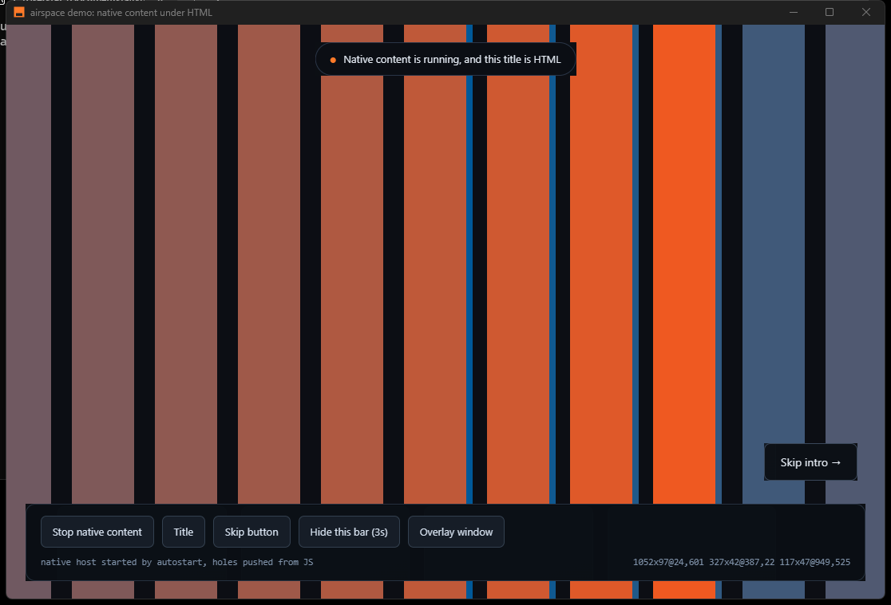
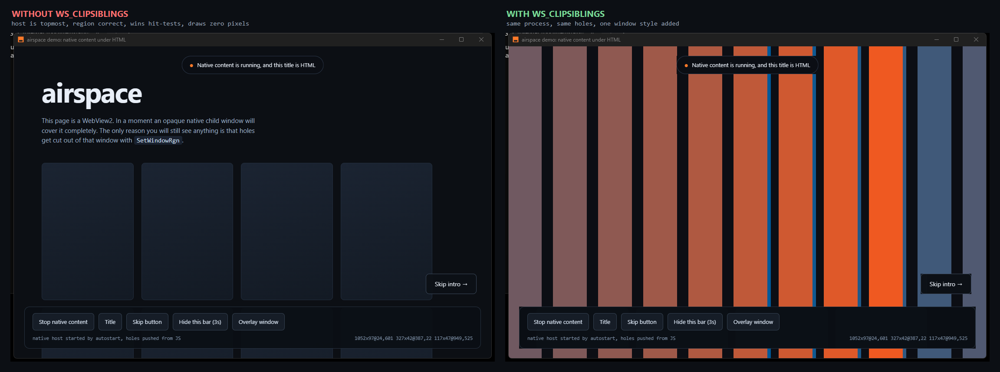

# airspace

[](https://github.com/lukr54/airspace/actions/workflows/ci.yml)

Render native content under or alongside HTML in a Tauri v2 window on Windows.



Everything in that screenshot except the moving bars is HTML. The bars are a
D3D11 swapchain in an opaque native child window covering the whole client area.
The title pill, the Skip intro button and the control bar are visible because
holes were cut out of that window's region with `SetWindowRgn`, measured in
JavaScript from the live DOM and sent to Rust.

The video isn't shrunk to make room for the controls.

## WS_CLIPSIBLINGS



One process, one window region (both status bars list the same three holes). The
left side is missing `WS_CLIPSIBLINGS` on the host and the webview, which makes
two overlapping siblings undefined under the Win32 rules, and WebView2 wins.

The host on the left is topmost in z-order, has a window region that reads back
correctly, and wins every `WindowFromPoint` hit-test. It draws nothing. That's
the failure this crate is meant to save you from.

## Contents

| | |
|---|---|
| [`tauri-plugin-airspace`](tauri-plugin-airspace/) | the crate, and the full write-up: why transparent webviews over native surfaces can't work, what to do instead, and everything that bites |
| [`examples/demo`](examples/demo/) | `cargo run -p airspace-demo`, no external dependencies |
| [`tools/verify-region.ps1`](tools/verify-region.ps1) | reads the host's region back so you can check the holes are real |

## Quick start

```bash
cargo run -p airspace-demo
```

Click **Start native content**, then toggle the overlays.

To bring the host up without clicking and print the region rectangles Windows is
clipping to:

```bash
AIRSPACE_DEMO_AUTOSTART=1 cargo run -p airspace-demo
```

```bash
powershell -File tools/verify-region.ps1
```

## Licence

MIT OR Apache-2.0.
